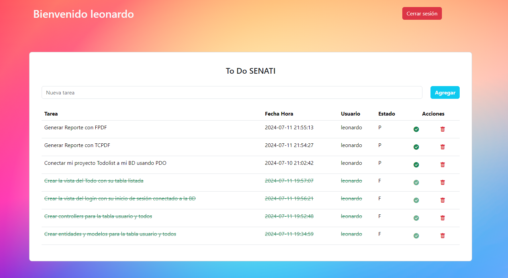

# To Do App SENATI

Este proyecto utiliza PHP y MySQL implementando Programación Orientada a Objetos (POO). Se emplea la capa de abstracción de acceso a datos PDO para gestionar la conexión y operaciones con MySQL. Además, se utilizan procedimientos almacenados (SP) en MySQL y el manejo de sesiones se gestiona mediante la superglobal $_SESSION de PHP, permitiendo mantener el estado del usuario a lo largo la aplicación.

## Frameworks Usados:

* **[Boostrap v5.3.3](https://getbootstrap.com)**
* **[JQuery v3.7.1](https://jquery.com)**
* **[AJAX](https://api.jquery.com/jQuery.ajax)**

